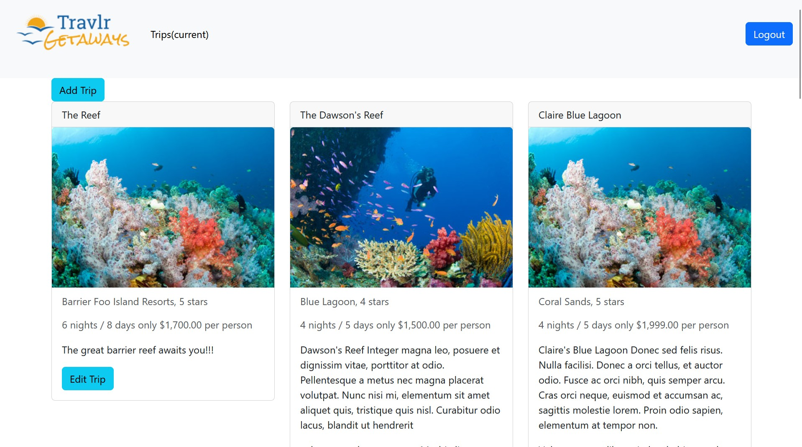
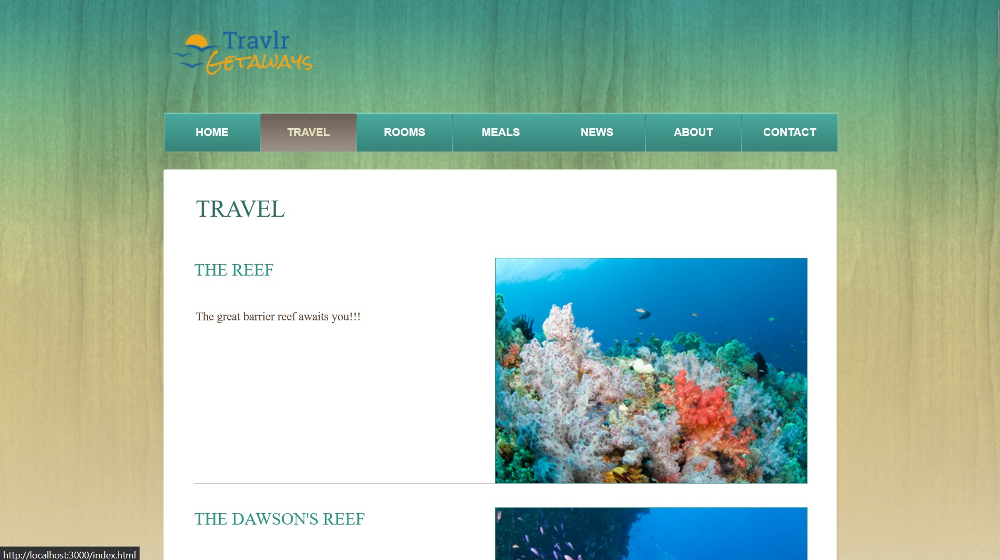
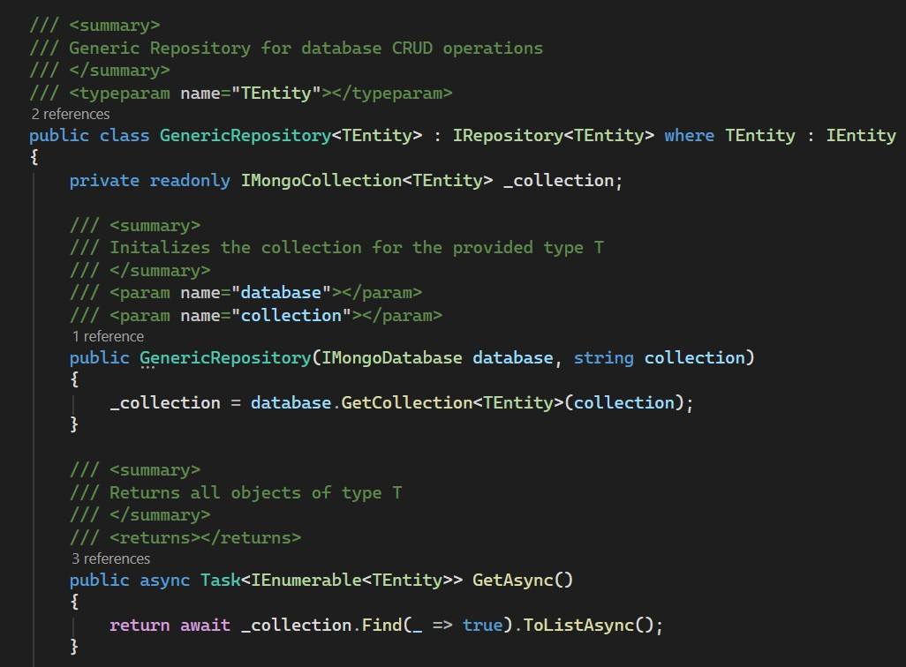
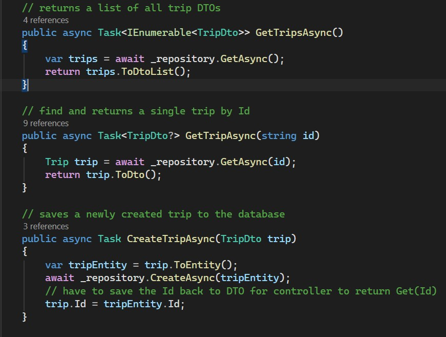

# ePortfolio for CS-499 Capstone

## Code Review



## Enhancement One: Software Design & Engineering

Repository Link: [Travlr-ASP.NET-Core](https://github.com/jmaSNHU/Travlr-ASP.NET-Core)

The Travlr project is a travel booking and destination web app that I built throughout the CS-465 – Full Stack Development course. Originally built with MongoDB, Express.js, Angular, and Node.js (MEAN stack), this app was meant to demonstrate competency in building the client-side user interface as well as the server-side logic and data persistence layers of a modern web application. The app consists of two clients: a customer-facing UI built with Node.js and Handlebars templates, and an administrative frontend built as an Angular single-page application. The project features a Node.js REST API that handles the app’s data persistence layer with MongoDB and allows both frontends to consume this data and render dynamic content. The project is a minimum viable product that currently contains only the endpoints for user authentication and trip destinations, but additional features could be added in the future, such as hotel reservations, meals, news, and other items currently rendered as static content on the customer-facing application.

I chose to improve this artifact to demonstrate my skills in software design and engineering by rewriting the Node.js REST API as an ASP.NET Core Web API written in C#. One of the reasons I selected this project is that it gives me the opportunity to showcase my skills in an area that aligns closely with my career aspirations in full stack web development. I believe the work I have included here demonstrates my ability to use industry-standard technologies and software design patterns to build extensible, flexible, and secure software that will be easy to maintain and build upon. 

Specifically, I have improved the design of this REST API by implementing a generic repository for MongoDB persistence that accepts any data models implementing a shared entity interface. This improvement abstracts the data access layer, which makes it easier to add additional models, change databases, and write unit tests by mocking the repository. I also created data transfer objects, or DTOs, for my model classes, which decouple the model from the data transmitted to the client and make it easy to hide data fields the client does not need to see, such as the user password hash. I wrote unit tests for the controllers, service, and repository to verify functionality, which made it easier to fix defects. To improve upon the basic JSON Web Token authentication, I used ASP.NET Core Identity, which provides access to robust out-of-the-box security features on top of standard JWT authentication, such as more secure password hashing and security stamps that expire if the user is modified. Identity also makes it easy to add role or claims-based authorization to manage user access control to different resources, which would be necessary if different types of users are introduced to the system, such as customer accounts and different employee roles.

One of my goals for this enhancement was to demonstrate my ability to use well-founded techniques and tools to deliver value in the form of a functional, well-designed, and tested full stack web application built with an industry-standard tech stack. I believe I have fulfilled this outcome by employing good design principles, notably the use of the repository pattern for data access and model-DTO separation, both of which are accepted best practices. I also aimed to demonstrate a security-minded approach that anticipates potential exploits, mitigates design flaws, and recognizes the need for enhanced security features. This is why I opted to use ASP.NET Core’s Identity API rather than create my own custom JWT authentication. The mindset is that Identity provides robust security by default but also allows developers to customize features as needed. In addition to these goals, I also tried to simulate a collaborative environment to support organizational decision making by staying active on my GitHub repository, creating issues, feature branches, and detailed commit messages as I would in a professional setting.

This enhancement has given me the opportunity to learn more about backend web development, software design patterns, and unit testing approaches. For instance, this was my first experience integrating MongoDB into a C# application. With this, I had to consider the tradeoff between using a much newer Entity Framework package for MongoDB or the more basic but widely used MongoDB driver. I chose the latter, with my reasoning being that it is better to rely on a more stable, well-known package for project maintainability and to minimize the risk of breaking changes. I also uncovered several new ideas and additional improvements that I had not initially intended. For example, I saw how the repository pattern would make it easier to add more functionality in the future and isolate the DTO mapping to the service layer. It also became clear that I needed to improve my documentation on my GitHub repository to make it easier for collaborators to use my code. I isolated specific features to separate branches, which makes source control easier to manage. I also added some setup instructions to the README, which I will continue to improve as needed.

