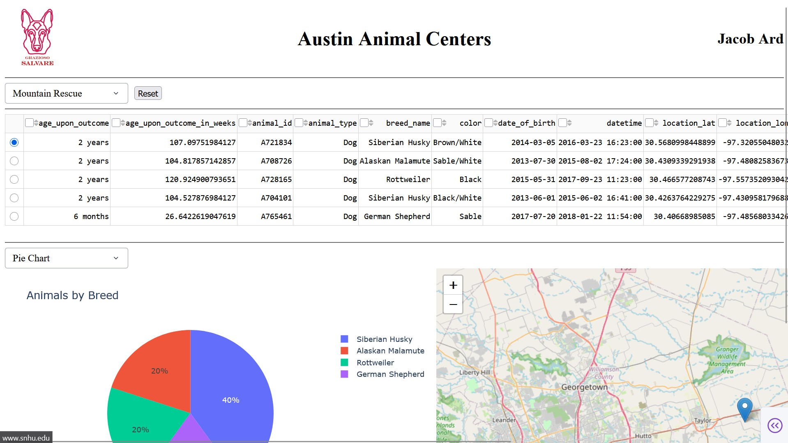
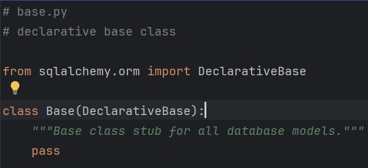
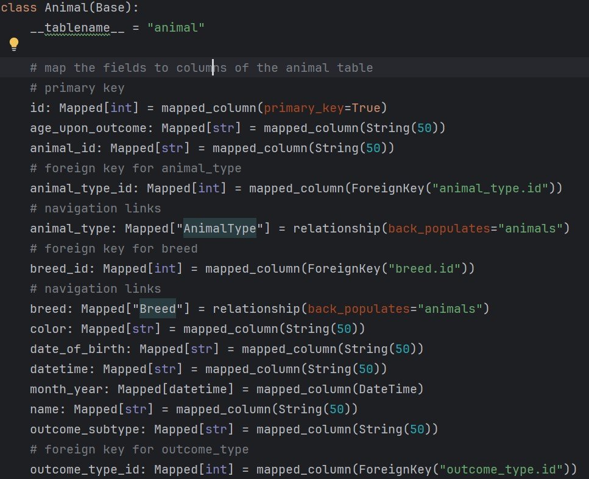
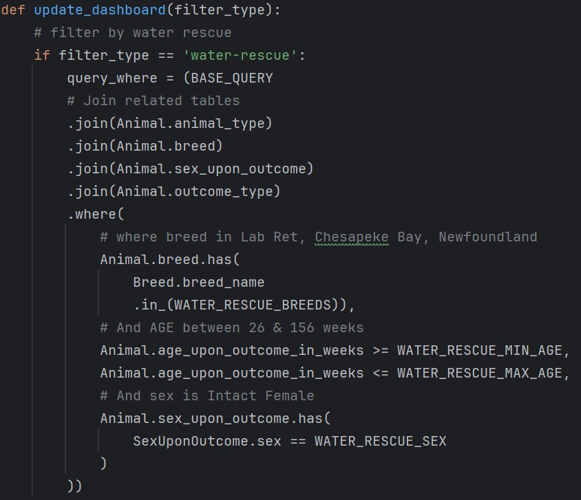

This artifact is a web based dashboard built with Python and the Plotly Dash framework. It served as the final project for CS 340 Client/Server Development and was meant to demonstrate my understanding of database principles and client/server development principles. The original project consists of a MongoDB database that stores data from the Austin Animal Center outcomes dataset, which includes information about animals such as name, breed, sex, age, and location. A Python module with create, read, update, and delete methods acts as a wrapper around the PyMongo module to expose basic CRUD functionality to the client application. The purpose of the client dashboard is to allow users to query the database for certain types of rescue animals, which involves filtering for specific dog breeds, age ranges, and sex status. The dashboard also displays a pie chart, a histogram, and a geolocation chart that places a pin on the currently selected animal’s longitude and latitude coordinates.

I chose to enhance this application by switching from a NoSQL database (MongoDB) to a relational database with SQLite. Since my first artifact for software design and engineering already used MongoDB for data persistence, I thought this would be a good opportunity to demonstrate my understanding of relational database management systems (RDBMS) using SQLite. One advantage of using a SQL database over NoSQL is the ability to create relational tables to eliminate redundancy and data duplication. For instance, separating the breed field from the animal table into a separate breed table and referencing it with a foreign key breed_id. This makes data maintenance easier since breed names can be adjusted in one place instead of updating hundreds of rows. 

I first created a SQLite database with an animal table and several related parent tables for attributes like animal type, breed, sex, and outcome. I wrote a pair of Python scripts for creating the SQLite database and importing raw data from a single CSV file into each table. I also used the SQLAlchemy ORM to define model classes for each table in the database, which abstracts much of the data access logic and eliminates the need for writing raw SQL for queries. SQLAlchemy also provides security advantages with prepared statements and allows complex operations like joins and subqueries. The last step for a fully functional application was to refactor the existing client code for the dashboard to use my model classes to fetch data from the database. 

With this enhancement I intended to demonstrate my ability to use well founded techniques, skills, and tools for the purpose of implementing computing solutions with a focus on relational database management systems. I also planned to evaluate computing solutions that solve a given problem using standard computer science practices, while managing the trade offs involved in design choices. I believe I’ve accomplished this by using a set of industry standard database tools with SQLite and the SQLAlchemy ORM, which each offer significant advantages in persistence and data access, albeit with some trade offs when compared to NoSQL databases. An RDBMS like SQLite provides the safety of a rigid schema and the ability to model complex data relationships that normalize data and eliminate redundancy. However, this comes at the expense of more complicated query operations, which require joining relational data and may impact performance for complex relationships. Similarly, while ORMs like SQLAlchemy provide a useful abstraction for database entities, they introduce technical debt, potential query optimization issues, and may not handle some complex queries.

Figure 1 - Declarative Base class that each model inherits from.

Figure 2 - Animal model class

During the implementation process, I learned a lot about SQLAlchemy and had to overcome several challenges when I implemented the model classes and refactored the client code. This was my first time working with SQLAlchemy, and I learned the modern approach to creating a base model, implementing models with foreign keys and relationship attributes, and writing queries with filtering and joins. One of the challenges I encountered was writing the queries that the client uses to filter for specific types of rescue animals. While the raw SQL needed for these queries is not complex, learning how to do this correctly in SQLAlchemy was a challenge because there are multiple ways to perform joins and filter queries, some of which are outdated but still supported as legacy methods. For instance, the legacy query method was replaced by select as the standard way to execute a SELECT statement in SQL. I also had to learn which methods correspond to the correct type of JOIN operation (i.e., outer vs. inner join).

Figure 3 - Example of query using the Animal class in the client code
