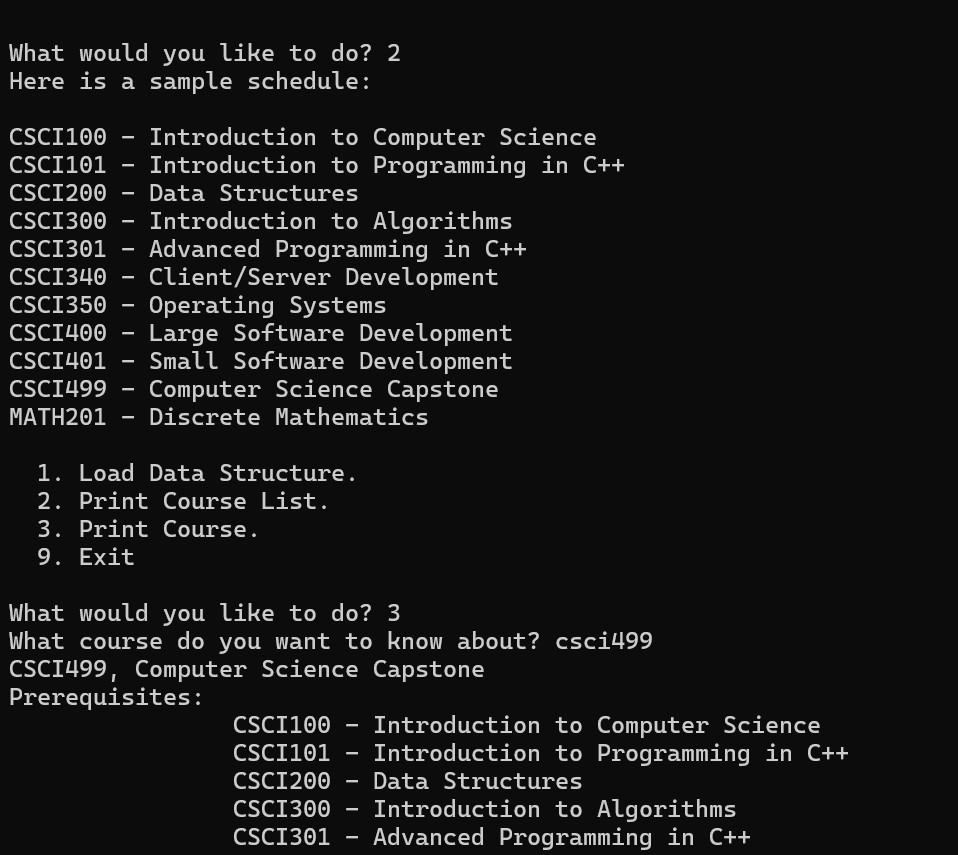
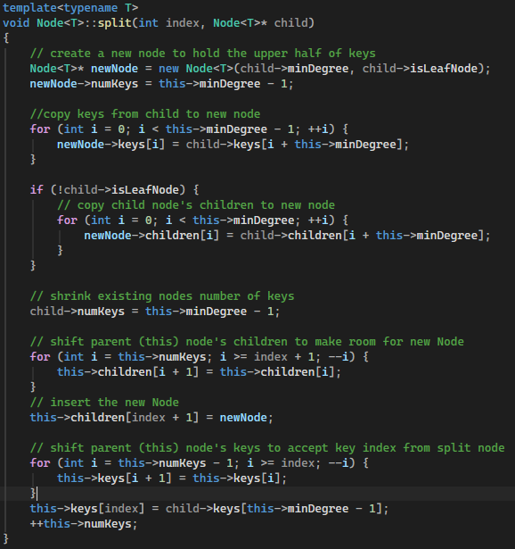
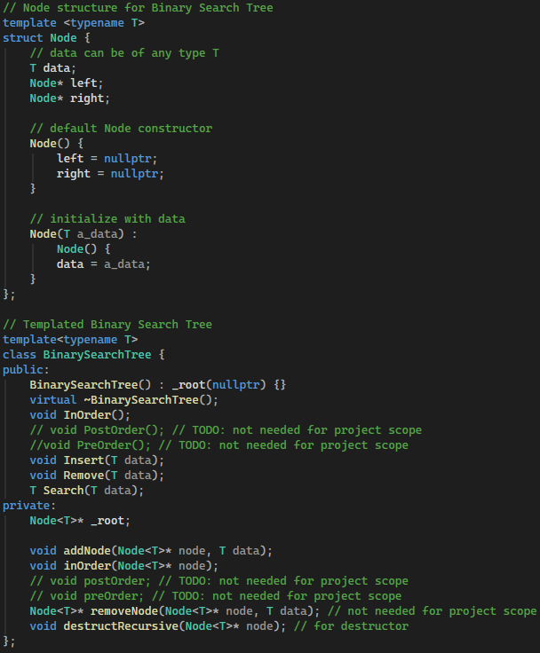

#### Enhancement Category: Algorithms & Data Structures

<table class="no-header-table">
  <tbody>
    <tr>
      <td>Original Artifact</td>
      <td><a href="https://github.com/jmaSNHU/CS-300" target="_blank">https://github.com/jmaSNHU/CS-300</a></td>
    </tr>
    <tr>
      <td>Enhanced Artifact</td>
      <td><a href="https://github.com/jmaSNHU/CourseList-BTree" target="_blank">https://github.com/jmaSNHU/CourseList-BTree</a></td>
    </tr>
  </tbody>
</table>

This C++ program is derived from the final project for CS-300 Design and Analysis of Data Structures and Algorithms. The purpose of this project was to demonstrate my ability to correctly implement a fundamental computer science data structure and apply it to a practical problem. The original project requirements were to write a program that reads a CSV file containing course data, which includes fields for Course Number, Course Name, and a list of prerequisite courses. The program must also be able to print all courses in alphanumeric order by course ID and search the data structure for a single course. I was given a choice to implement one of three data structures: Binary Search Tree, Hash Table, or Vector. A Binary Search Tree, or BST, was a natural choice for this solution because it typically includes an in-order traversal method that satisfies the sorting requirement, while Hash Tables are inherently unordered and Vectors would require a less efficient sort operation after loading the initial data structure.

I chose to enhance this artifact by implementing a B-Tree data structure to replace my original BST implementation. One reason I chose this approach is that my original BST class lacks a rebalance function. As BSTs grow in height and size, their performance degrades toward a worst-case O(n) runtime complexity. To prevent this and maintain an average O(log n) complexity for search, insert, and delete operations, they must be periodically rebalanced. I decided to implement a B-Tree because it is inherently self-balancing and therefore guarantees a worst-case runtime complexity of O(log n). B-Trees differ from BSTs in that each node can hold multiple keys and multiple children rather than two, which is determined by a minimum degree factor. The trade-off is that the implementation of B-Tree operations is much more complex than the BST. For example, the B-Tree maintains balance with a function that splits full child nodes and moves the median key to the parent node. 

 

The course outcome I hope to demonstrate with this enhancement is to design and evaluate computing solutions that solve a given problem using algorithmic principles and computer science practices and standards appropriate to its solution, while managing the trade-offs involved in design choices. I have demonstrated my ability to implement an advanced data structure in the form of a B-Tree, which is a fundamental computer science data structure often used to implement database indexes. I have implemented the B-Tree's insert, search, and in-order traversal methods using efficient algorithms that should guarantee a worst-case O(log n) complexity for insert and search operations and O(n) complexity for traversal. I have also explained the benefits and drawbacks of the B-Tree compared to the BST, which provides a better worst-case complexity for all major operations compared to the BST before rebalancing. The trade-off is that B-Tree code is significantly harder to implement, debug, and maintain when compared to the BST. 

The implementation process for this artifact was much more difficult than the original BST project. I encountered one difficult bug that I eventually traced back to my split-node method, which was caused by accessing an index out of bounds in the child node array. I also learned some C++ techniques, such as the use of lambda functions that can capture local variables and pass them to another function using the std::function wrapper. I used this approach to solve a challenging problem related to updating and validating the prerequisite Course vector for the Course class. Perhaps the most pleasant aspect of this enhancement was that the work I put into the original artifact proved valuable. My experience with template metaprogramming made it easy to apply similar techniques to this project, which allowed for straightforward testing with primitive types. The use of templates also makes this data structure generic and reusable, since it can accept any type of object that overloads comparison operators. The ability to reuse my original Course class also demonstrates the benefits of object-oriented programming principles.
